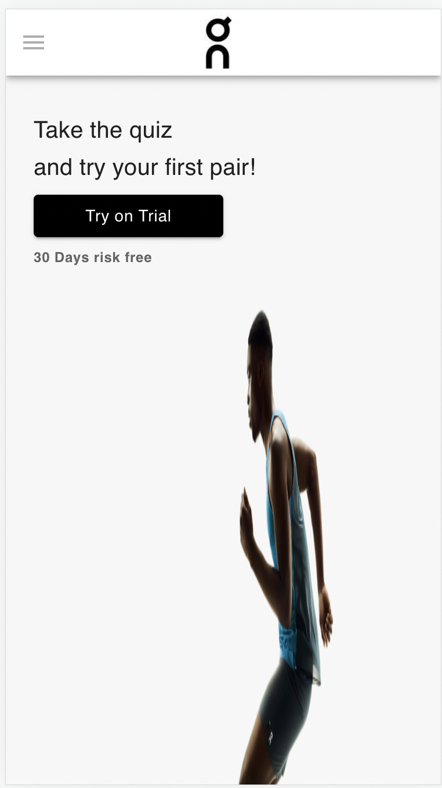
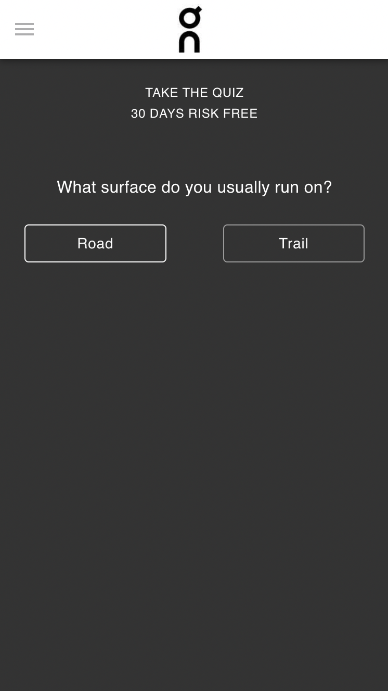
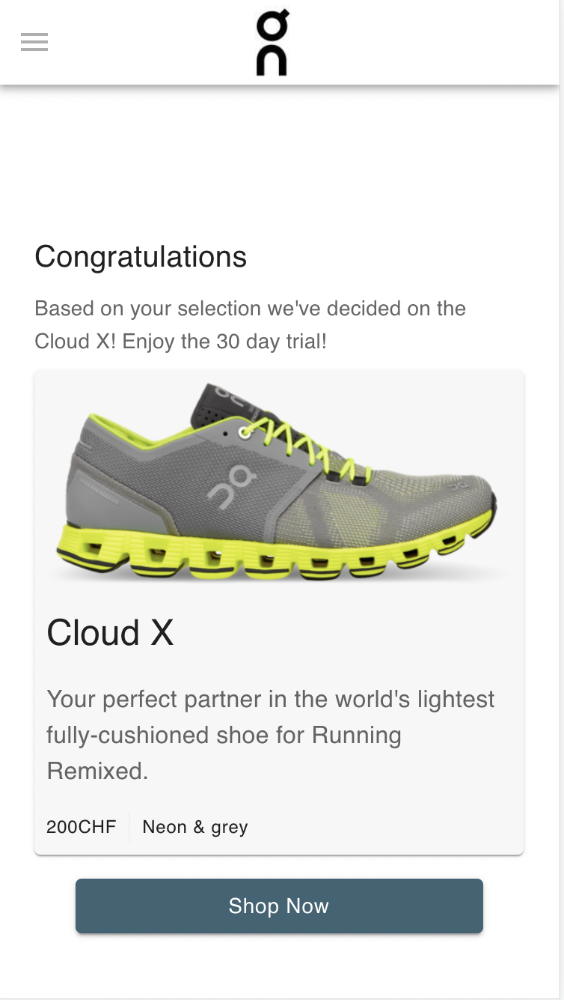
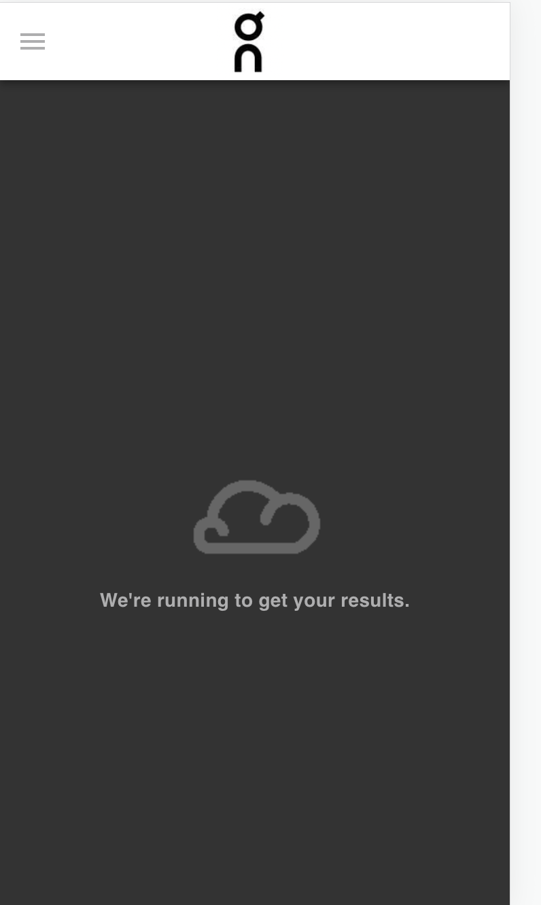

# Getting Started with Create React App

This project comprises of a small quiz for runners to find their perfect shoe. This project looks best on a mobile device.
It is currently live on [https://shoes-quiz.vercel.app/]

## Setting project on Local Environment

### `npm install` 

This command will install all the required dependencies

### `npm start`

Runs the app in the development mode.\
Open [http://localhost:3000](http://localhost:3000) to view it in your browser.

## Folder Structure

* Images are present in the 'src/assets/img/' folder
* common reusable visual components are present in the 'src/common' folder
* Different views are seperated and its associated components are placed within 'src/views/' folder
* different reusable utility functions are present in 'src/utils' folder

## Layouts

